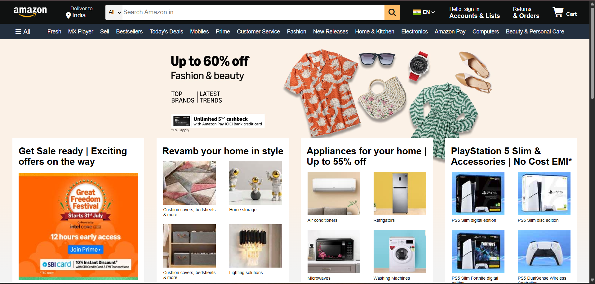

# 📦 Amazon Web Page Clone

<h4> A clone of Amazon india homepage using HTML and CSS .This project is for learning and demostration purpose only.</h4>

Technologies Used
1 - HTML
2 - CSS

# Preview

📌 Note
This is not a commercial product. It’s a frontend practice project and all assets (logos, images) are used only for educational purposes. 

🙋‍♂️ Author 
Piyush Sah 
BCA 2nd Year Student 
Ms Ramaiah College of Arts, Science, and Commerce 
Bangalore 
